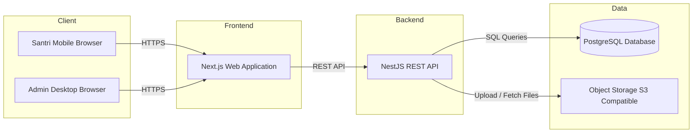

# System Architecture

## Overview

The system is a fullstack web application designed to manage and verify SPP (student tuition) payment proofs for a pesantren. It follows a **client–server architecture** with a clear separation between frontend and backend.

- The **frontend** is a web application built with Next.js, optimized for mobile usage for santri and desktop usage for administrators.
    
- The **backend** is a RESTful API built with NestJS, responsible for authentication, business logic, and data integrity.
    
- A **relational database (PostgreSQL)** is used as the system of record.
    
- **Object storage** is used for storing uploaded payment proof files.
    
- The system is stateless, non-realtime, and workflow-driven.
    

---

## Architecture Diagram

---

## Components

### Frontend

- **Technology:** Next.js (App Router), TypeScript
    
- **Responsibilities:**
    
    - User authentication and session handling
        
    - Role-based UI rendering (Admin vs Santri)
        
    - Mobile-first interface for santri
        
    - Form handling and client-side validation
        
    - Display of invoice status, history, and notifications
        
- **Characteristics:**
    
    - Stateless
        
    - Responsive design (mobile-first for santri)
        
    - Communicates with backend via REST API
        

---

### API / Backend

- **Technology:** NestJS (Node.js, TypeScript)
    
- **Responsibilities:**
    
    - Authentication and authorization (JWT, RBAC)
        
    - Business logic and workflow enforcement
        
    - SPP invoice generation and state management
        
    - Payment proof verification and rejection
        
    - Notification generation
        
    - Import/export processing
        
- **Architecture Pattern:**
    
    - Modular (feature-based modules)
        
    - Controller → Service → Data Access
        
    - Stateless REST API
        

---

### Database

- **Technology:** PostgreSQL
    
- **Access Layer:** Prisma ORM
    
- **Responsibilities:**
    
    - Persistent storage of users, santri, invoices, payment proofs, and notifications
        
    - Enforce relational integrity
        
- **Characteristics:**
    
    - Relational schema
        
    - ACID-compliant
        
    - Single source of truth for payment status
        

---

### Third-Party Services

- **Object Storage (S3-compatible)**
    
    - Stores uploaded payment proof files (images/PDFs)
        
    - Backend stores only file metadata and URLs
        
- **Optional (Future)**
    
    - Email or messaging service for external notifications
        
    - Payment gateway integration (out of scope for now)
        

---

## Data Flow

### Example: Santri Uploads Payment Proof

1. **User Action**  
    Santri logs in and uploads a payment proof via the mobile web interface.
    
2. **Frontend Request**  
    Next.js frontend sends a multipart HTTP request to the NestJS API.
    
3. **Backend Processing**
    
    - Authenticates the user
        
    - Validates role (SANTRI)
        
    - Validates invoice state (UNPAID or REJECTED)
        
    - Validates file type and size
        
4. **Database Interaction**
    
    - Uploads file to object storage
        
    - Stores payment proof metadata in PostgreSQL
        
    - Updates invoice status to PENDING
        
5. **Response to User**  
    Backend returns success response; frontend updates UI and displays “Waiting for verification” status.
    

---

## Key Design Considerations

### Scalability

- Backend is stateless, enabling horizontal scaling.
    
- Object storage offloads large file handling from application servers.
    
- Modular NestJS architecture allows feature-level scaling and refactoring.
    

---

### Security

- JWT-based authentication with role-based access control.
    
- Passwords hashed using industry-standard algorithms.
    
- HttpOnly cookies for token storage.
    
- Backend-enforced state machine prevents invalid transitions.
    
- File uploads validated by type and size.
    

---

### Maintainability

- Clear separation of concerns (Frontend, Backend, Database).
    
- Feature-based NestJS modules.
    
- Explicit state machine for SPP workflows.
    
- Type-safe database access via Prisma.
    
- Consistent API contracts and DTO validation.
    
